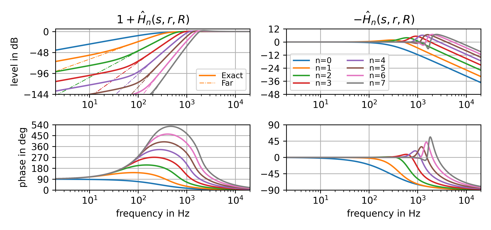
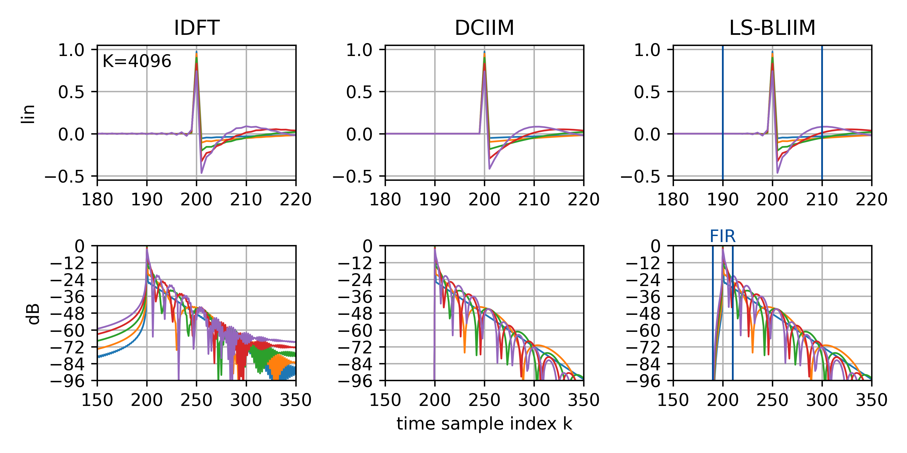
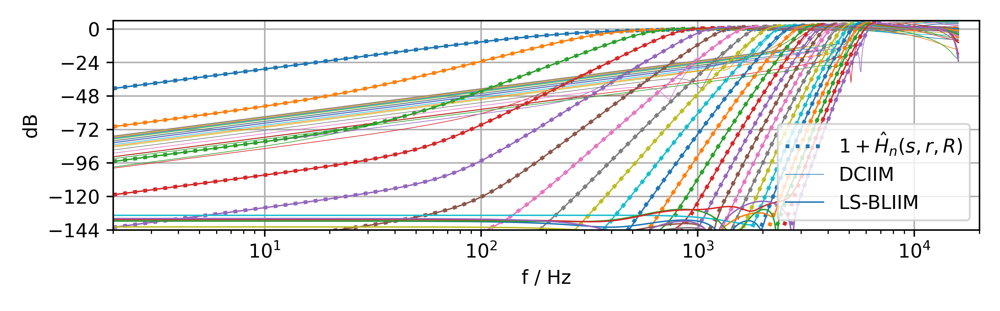
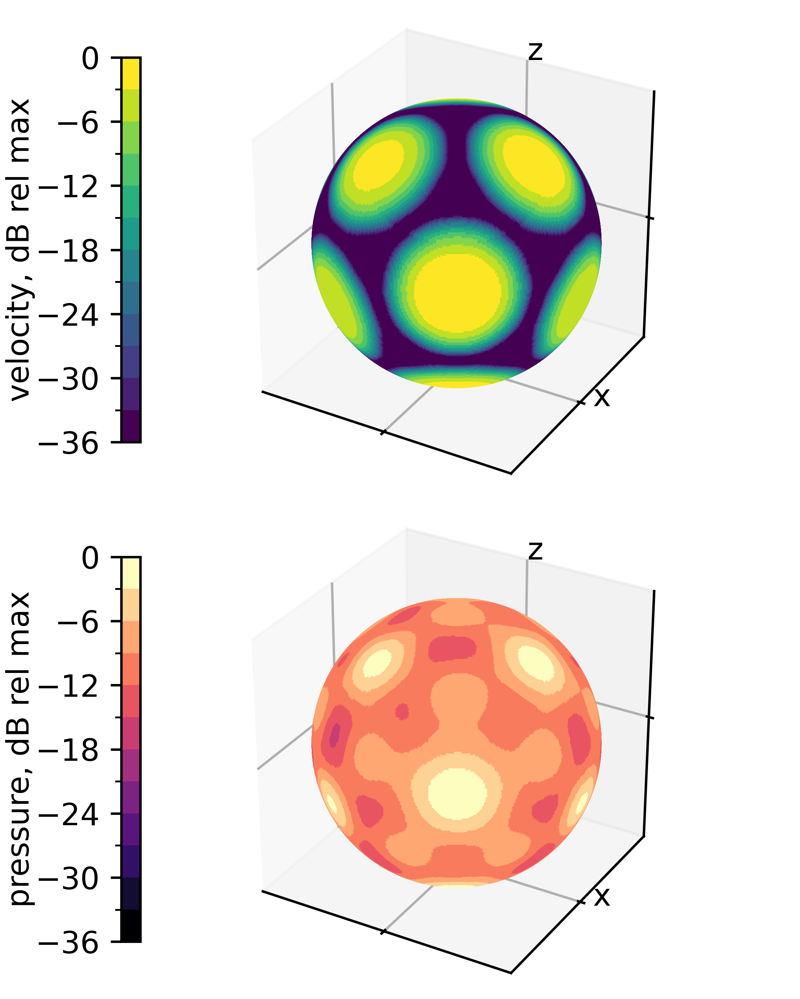
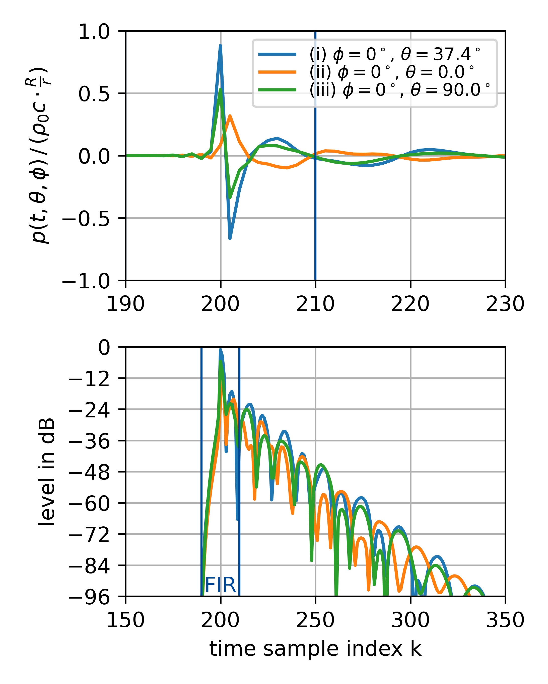

# daga2026_dode

## Project
Frank Schultz, Nara Hahn, Sascha Spors (2026):
"Time-Domain Radiation Model of a Cap on a Rigid Sphere"
In: Proc. 52nd DAGA, Dresden, https://2026.daga-tagung.de/

- [paper (pdf)](Schultz_2026_Dode_DAGA_Paper.pdf)
- [poster (pdf)](Schultz_2026_Dode_DAGA_Poster.pdf)

## Abstract

The velocity-to-pressure exterior wave field expansion for spherically shaped
radiators is well known.
It involves a modal radial filter, based on the spherical Hankel function and
its derivative, which can be given as a Laplace-domain transfer function.
Its frequency-dependent part can be expressed as partial fraction expansion and
is consequently suited for the impulse invariance digital filter design method.
This was utilised for radial directivity control of spherical loudspeaker arrays,
which essentially deals with the inverse radial filters compared to the here
discussed radiation case.
Recently, a band-limited impulse invariance method (BLIIM) was introduced.
This improves radial filters for spherical microphone arrays by reduction of
time-domain aliasing.
In the present paper a BLIIM for the above mentioned radiation model is proposed.
By using a specific modal velocity spectrum of non-overlapping spherical cap
pistons on a rigid sphere, the direction-dependent radiation and the far-field
directivity of such a source can be modelled with dedicated digital filters.
As an example, a numerical implementation for a dodecahedron radiator is
discussed, which could be utilised within an image source model
and as theoretical time-domain model in the field of directional (room) impulse
responses.

## Theory in Short

Frequency response of radial filter (for $r>R$)
$$H_n(\omega,r,R) = -\mathrm{j} \frac{h_n^{(2)}(\frac{\omega}{c}r)}{h_n^{'(2)}(\frac{\omega}{c}R)}$$
can be stated as frequency response
$$H_n(\omega,r,R) = \frac{R}{r} \mathrm{e}^{-\mathrm{j}\omega (\frac{r-R}{c})} \cdot (1 + \hat{H}_n(s\big|_{s=\mathrm{j}\omega},r,R))$$
using the $n+1$ poles Laplace transfer function $\hat{H}_n(s,r,R)$ in partial fraction
expansion (PFE) representation.

The PFE is suitable for the impulse invariance method (IIM) to design a filter bank
of digital filters.

The recently introduced band-limited IIM (BLIIM) considerably improves the filters / impulse
responses and outperforms the frequency sampling method and DC matched IIM (DCIIM).

## Essence in Graphics

*Radial filters ground truth for r=2m, R=0.2m, c=343 m/s.*

*Digital filterbank design for radial filters for r=2.34375 m, R=0.2m, fs=32 kHz, c=343 m/s.*

*Application example: dodecahedron modelled with spherical cap pistons. Velocity function at radius R (top), pressure in 4 kHz third-octave band at distance r (bottom).*

*Application example: dodecahedron modelled with spherical cap pistons. Pressure impulse responses at different directions but with same distance r.*